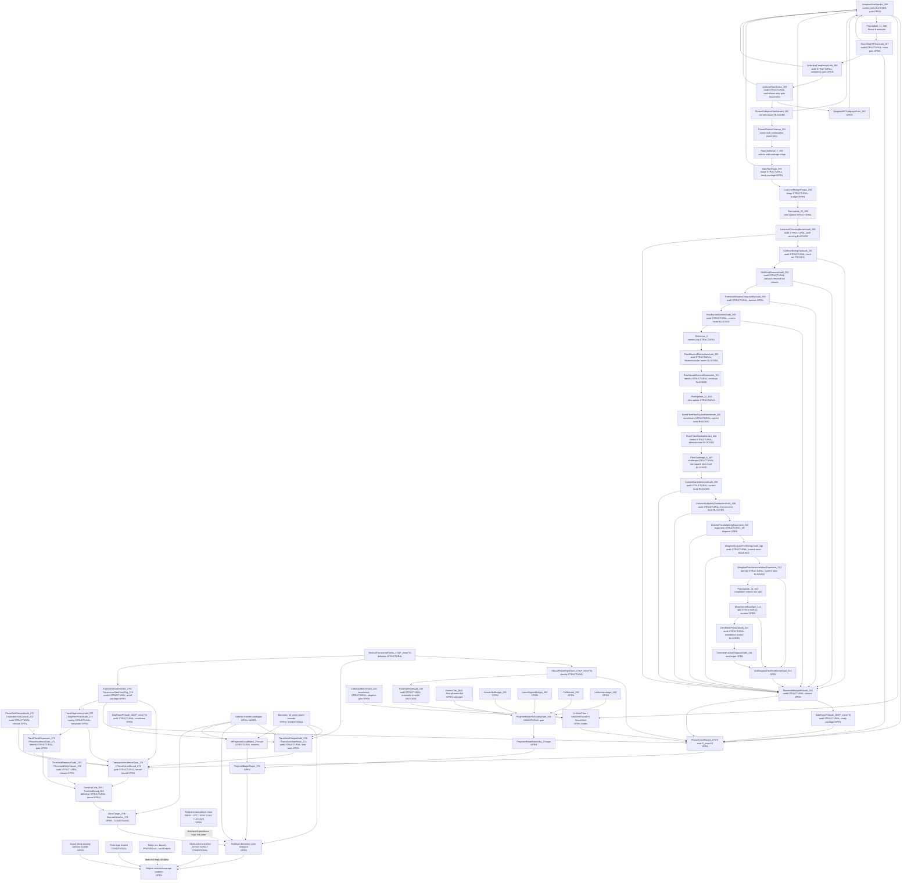

# Dependency Graph

This graph is a status map, not a proof. Solid arrows mean "would require" or
"feeds into if established." Dashed arrows mark structural/equivalence
relationships that must not be read as analytic closure.

## Reading Discipline

- The graph does not license using an endpoint object as an input to prove
  that same endpoint.
- The signed Phase H fork may target exact-model neutrality, but it does not
  prove the absolute row `CollNeutral_260`.
- The actual selected-average problem still needs the actual sharp moving
  selector and full gap discipline; model/frozen/smoothed rows are not enough.
- Phase J now has `P_minor^0`; that definition is a convention package, not a
  proof of `PhaseKernelBound_273^0`.
- `XiDualPhaseExpansion_279` is an identity ledger. It does not transfer
  fixed frequency-set estimates to data-dependent shells.
- `FixedSetShellAudit_280` blocks automatic transfer; the open routes still
  require uniform adaptive-fiber, selection-transfer, or direct-shell input.
- `LSBesselBenchmark_281` records that current non-endpoint Bessel bounds
  reproduce row/column ceilings, not adaptive shell closure.
- `DegRowsP0Audit_282` removes some degeneracies only inside the minimal
  model by convention; it does not prove row/column, major-difference,
  physical-diagonal, or deg-free smallness.
- `SideRowsP0Audit_283` removes boundary, fixed-residue, prime-only, and
  selector-change rows only inside the minimal model by convention; it does
  not prove W-uniformity, threshold-budget, low-level cutoff, dyadic
  uniformity, or adaptive shell-selection rows.
- `ThresholdBudgetP0Audit_284` names the threshold budgets and optimized
  barriers required inside `P_minor^0`; these barriers are diagnostics, not
  estimates.
- `AdaptiveShellVerdict_285` marks the current Phase J tool package as
  blocked for `PhaseKernelBound_273^0`; it does not disprove the local target
  or any endpoint.
- `PlanUpdate_11_286` pauses Phase J and starts Phase K as adaptive-shell
  gain triage. The first Phase K test is the direct-shell `TT*` cross-term
  audit, not a claimed gain.
- `DirectShellTTStarAudit_287` isolates `DirectShellCrossTermGain_287` as
  open; Cauchy/Bessel, fixed-set, full-orthogonality, and endpoint-derived
  closures remain blocked.
- `SelectionComplexityAudit_288` records that raw union selection,
  fixed-threshold-to-fixed-fiber transfer, and favorable phase selection do
  not supply `SelectionComplexityGain_288`; row/column graph entropy is only a
  diagnostic until a uniform theorem is proved.
- `UniformFiberStress_289` blocks row/column-only uniform-fiber gain; a
  useful uniform route would need `WeightedRCSubgraphGain_289` or another
  same-family residual-structure theorem.
- `PhaseKAdaptiveShellVerdict_290` records that the current Phase K package
  does not prove `AdaptiveShellGainP0_285`; the local target and all endpoint
  objects remain open.
- `PhaseKStatusCleanup_291` blocks continuing Phase K without a new input and
  prepares `ChallengePacket_291` for the seventh plan challenge.
- `PlanChallenge_7_292` selects side-package triage as the next branch; this
  is not a proof of the side package or adaptive shell gain.
- `SidePkgTriage_293` splits the side package and returns shell selection and
  deg-free phase rows to the adaptive core; the next narrow side target is
  low-level leakage.
- `LowLevelBudgetTriage_294` classifies the below-`lambda_min` row and gives
  deterministic counting barriers, but it does not prove
  `LowLevelBudgetP0_284`, `LowLevelCutoffP0_283`, or any threshold closure.
- `PlanUpdate_12_295` keeps the side-package branch narrow and selects
  `LowLevelCountingBarrierAudit_296`; that next target is still open and must
  test the exact reconstruction formula and target weights.
- `LowLevelCountingBarrierAudit_296` blocks pure counting under the current
  declarations and extracts the open second-energy tail target
  `LowLevelEnergyTailTarget_296`.
- `E2MinorEnergyTailAudit_297` proves the local fourth-moment low-level tail
  inside `P_minor^0` only. It does not prove the shift/frequency removal
  budgets or the threshold package.
- `ShiftFreqRemovalAudit_298` proves only vacuous actual bad-set removal
  inside `P_minor^0`; maximal thresholds are not a usable threshold closure.
  The next live question is threshold-window compatibility.
- `ThresholdWindowCompatibilityAudit_299` reduces useful threshold-window
  closure to optimized barrier smallness plus admissible threshold scheduling.
  The current trivial caps do not prove those barriers.
- `RowBarrierMomentAudit_300` shows that the current energy-only row route
  gives only a polylogarithmic ceiling. The row barrier remains open and now
  needs a genuine row-energy distribution or high-moment gain.
- `Reflective_4` is a memory log for Modules 261-300. It records no theorem
  upgrade and points the next mathematical work to `RowMomentDistributionAudit_302`.
- `RowMomentDistributionAudit_302` is a structural audit: layer-cake is a
  criterion, current Markov tails are blocked at the Module 300 ceiling, and
  the fourth-moment route is circular without an independent theorem.
- `RowSquareMomentExpansion_303` is an identity ledger. It expands the q=2
  row-square object into exact same-shift restricted kernels over
  data-dependent fibers, blocks full-frequency/fixed-fiber/endpoint shortcuts,
  and leaves `SameShiftSquareKernelGain_303` open.
- `PlanUpdate_13_304` selects `FixedFiberRowSquareBenchmark_305` before a
  direct attack on the data-dependent same-shift row-square kernel.
- `FixedFiberRowSquareBenchmark_305` shows that prescribed fibers remove the
  selection issue but current tools still recover ceiling-scale row-square
  bounds. The fixed-fiber branch now needs a blocked verdict or a genuinely
  smaller size-sensitive criterion.
- `FixedFiberBlockedVerdict_306` blocks selection transfer as the immediate
  next step and sends the row-square branch to `PlanChallenge_8_307`.
- `PlanChallenge_8_307` pauses direct row-square continuation under the
  current toolkit and selects `ColumnBarrierMomentAudit_308`; this is a
  steering decision, not a column estimate.
- `ColumnBarrierMomentAudit_308` extracts first-incidence column ceilings and
  blocks the current column-barrier route; it does not prove either Module
  284 column barrier.
- `ColumnMultiplicityDistributionAudit_309` gives an exact layer-cake
  formulation but blocks first-moment tails as a gain route; the next concrete
  test is the `r=2` same-frequency shift-pair expansion.
- `ColumnPairMultiplicityExpansion_310` expands the `r=2` column moment and
  isolates the off-diagonal same-frequency pair row; the weighted
  coefficient-pair route is still only a criterion.
- `WeightedColumnPairEnergyAudit_311` records that energy-square and
  fourth-power Cauchy estimates return ceiling-scale weighted pair bounds
  under current inputs. It blocks current tools as weighted pair closure and
  sends the next step to the exact weighted pair autocorrelation expansion.
- `WeightedPairAutocorrelationExpansion_312` is an exact identity ledger: it
  rewrites `WPair(d_1,d_2)` as an anti-diagonal two-shift autocorrelation
  kernel with the minor cutoff. Full-frequency and minor-kernel
  decompositions are diagnostics only; the open analytic row is
  `AntiDiagonalTwoShiftKernelGain_312`.
- `PlanUpdate_14_313` blocks direct attack on the bundled anti-diagonal
  target as the next move and selects `MinorKernelRowSplit_314`; that split
  must classify full-frequency, zero-mode, and major-correction rows before
  any weighted pair gain is claimed.
- `MinorKernelRowSplit_314` gives the exact full/zero/major partition of
  `WOff_311`, but independent row smallness is blocked under current tools.
  The next local audit is the zero-mode product row.
- `ZeroModeProductAudit_315` shows that the zero row is not killed by the
  minor convention and not controlled by current tools, but it can be removed
  as an explicit correction by using centered products. The next audit is the
  centered full anti-diagonal row.
