# Dependency Graph

This graph is a status map, not a proof. Solid arrows mean "would require" or
"feeds into if established." Dashed arrows mark structural/equivalence
relationships that must not be read as analytic closure.

```mermaid
flowchart TD
  Original["Original selected-average problem<br/>OPEN"]
  SharpSel["Actual sharp moving selector transfer<br/>OPEN"]
  FiniteType["Finite-type branch<br/>CONDITIONAL"]
  Metric["Metric a.e. branch<br/>PROVEN a.e.; not all-alpha"]
  Obstruction["Obstruction branches<br/>STRUCTURAL / CONDITIONAL"]

  ResCube["Residual derivative cube endpoint<br/>OPEN"]
  MajorTarget["ProjectedMajorTarget_3^B<br/>OPEN"]
  MinorTarget["MinorTarget_3^B / NarrowMinorArc_3^B<br/>OPEN / CONDITIONAL"]
  TransInc["TransIncCore_269 / TransIncBound_269<br/>definition STRUCTURAL; bound OPEN"]
  ThresholdAudit["ThresholdRemovalAudit_270 / ThresholdOnlyClosure_270<br/>audit STRUCTURAL; closure OPEN"]
  PhaseExpansion["TransPhaseExpansion_271 / PhaseIncidenceGate_271<br/>identity STRUCTURAL; gate OPEN"]
  ToolCompat["PhaseToolCompatAudit_272 / AvailableToolClosure_272<br/>audit STRUCTURAL; closure OPEN"]
  TransGate["TransverseIncidenceGate_273 / PhaseKernelBound_273<br/>gate STRUCTURAL; kernel bound OPEN"]
  TransGateCompat["TransGateCompatAudit_274 / TransGateSideRows_274<br/>audit STRUCTURAL; side rows OPEN"]
  DegAudit["TransDegeneracyAudit_275 / DegFreePhaseGate_275<br/>routing STRUCTURAL; remainder OPEN"]
  TransVerdict["TransverseGateVerdict_276 / TransverseGateProofPkg_276<br/>verdict STRUCTURAL; proof package OPEN"]
  MinTransFamily["MinimalTransverseFamily_278(P_minor^0)<br/>definition STRUCTURAL"]
  XiExpansion["XiDualPhaseExpansion_279(P_minor^0)<br/>identity STRUCTURAL"]
  FixedShellAudit["FixedSetShellAudit_280<br/>audit STRUCTURAL; automatic transfer BLOCKED"]
  FixedShellTransfer["UniformFiber / SelectionTransfer / DirectShell<br/>OPEN routes"]
  LSBesselBench["LSBesselBenchmark_281<br/>benchmark STRUCTURAL; adaptive gain OPEN"]
  DegRowsP0["DegRowsP0Audit_282(P_minor^0)<br/>audit STRUCTURAL; smallness OPEN"]
  SideRowsP0["SideRowsP0Audit_283(P_minor^0)<br/>audit STRUCTURAL; ready package OPEN"]
  ThresholdP0["ThresholdBudgetP0Audit_284<br/>audit STRUCTURAL; closure OPEN"]
  AdaptiveShellP0["AdaptiveShellVerdict_285<br/>current tools BLOCKED; gain OPEN"]
  PlanUpdate11["PlanUpdate_11_286<br/>next steering update"]
  PhaseKernel0["PhaseKernelBound_273^0 over P_minor^0<br/>OPEN"]
  SelectorTransfer["Selector transfer packages<br/>OPEN / MIXED"]
  BoundaryTransfer["Boundary, W, prime-power transfer<br/>OPEN / CONDITIONAL"]

  WLocal["WProjectedLocalMatch_3^major<br/>CONDITIONAL schema"]
  ModelNeutral["ProjectedModelNeutrality_3^major<br/>OPEN"]
  PMNGate["ProjectedModelNeutralityGate_260<br/>CONDITIONAL gate"]
  GenericTail["GenericTail_260 / SharpGenericTail<br/>OPEN subtarget"]
  KernelAbs["KernelAbsBudget_265<br/>OPEN"]
  KernelSigned["KernelSignedBudget_265<br/>OPEN"]
  CollNeutral["CollNeutral_260<br/>OPEN"]
  Uniformity["UniformityLedger_266<br/>OPEN"]

  EndpointClass["Endpoint equivalence class<br/>RBDH / CPC / SPAC / SU2 / U2 / AU3<br/>OPEN"]

  SharpSel --> Original
  FiniteType --> Original
  Obstruction --> Original
  ResCube --> Original
  Metric -. "does not imply all-alpha" .-> Original

  MajorTarget --> ResCube
  MinorTarget --> ResCube
  TransInc --> MinorTarget
  ThresholdAudit --> TransInc
  PhaseExpansion --> TransInc
  ToolCompat --> PhaseExpansion
  TransGate --> TransInc
  PhaseExpansion --> TransGate
  ToolCompat --> TransGate
  TransGateCompat --> TransGate
  SelectorTransfer --> TransGateCompat
  BoundaryTransfer --> TransGateCompat
  DegAudit --> TransGate
  DegAudit --> PhaseExpansion
  TransVerdict --> TransGate
  TransVerdict --> TransGateCompat
  TransVerdict --> DegAudit
  PhaseKernel0 --> TransGate
  MinTransFamily --> XiExpansion
  XiExpansion --> PhaseKernel0
  XiExpansion --> FixedShellAudit
  FixedShellAudit --> FixedShellTransfer
  FixedShellTransfer --> PhaseKernel0
  LSBesselBench --> FixedShellTransfer
  DegRowsP0 --> PhaseKernel0
  SideRowsP0 --> PhaseKernel0
  ThresholdP0 --> SideRowsP0
  ThresholdP0 --> PhaseKernel0
  AdaptiveShellP0 --> PhaseKernel0
  AdaptiveShellP0 --> FixedShellTransfer
  AdaptiveShellP0 --> PlanUpdate11
  MinTransFamily --> TransGateCompat
  MinTransFamily --> TransVerdict
  SelectorTransfer --> ResCube
  BoundaryTransfer --> ResCube
  EndpointClass -. "structural/equivalence map, not proof" .-> ResCube

  WLocal --> MajorTarget
  ModelNeutral --> MajorTarget

  PMNGate --> ModelNeutral
  GenericTail --> PMNGate
  KernelAbs --> PMNGate
  KernelSigned --> PMNGate
  CollNeutral --> PMNGate
  Uniformity --> PMNGate

  BoundaryTransfer --> WLocal
  SelectorTransfer --> WLocal
  SelectorTransfer --> MinorTarget
```

## Reading Discipline

- The graph does not license using an endpoint object as an input to prove
  that same endpoint.
- The signed Phase H fork may target exact-model neutrality, but it does not
  prove the absolute row `CollNeutral_260`.
- The actual selected-average problem still needs the actual sharp moving
  selector and full gap discipline; model/frozen/smoothed rows are not enough.
- Phase J now has `P_minor^0`; that definition is a convention package, not a
  proof of `PhaseKernelBound_273^0`.
- `XiDualPhaseExpansion_279` is an identity ledger. It does not transfer
  fixed frequency-set estimates to data-dependent shells.
- `FixedSetShellAudit_280` blocks automatic transfer; the open routes still
  require uniform adaptive-fiber, selection-transfer, or direct-shell input.
- `LSBesselBenchmark_281` records that current non-endpoint Bessel bounds
  reproduce row/column ceilings, not adaptive shell closure.
- `DegRowsP0Audit_282` removes some degeneracies only inside the minimal
  model by convention; it does not prove row/column, major-difference,
  physical-diagonal, or deg-free smallness.
- `SideRowsP0Audit_283` removes boundary, fixed-residue, prime-only, and
  selector-change rows only inside the minimal model by convention; it does
  not prove W-uniformity, threshold-budget, low-level cutoff, dyadic
  uniformity, or adaptive shell-selection rows.
- `ThresholdBudgetP0Audit_284` names the threshold budgets and optimized
  barriers required inside `P_minor^0`; these barriers are diagnostics, not
  estimates.
- `AdaptiveShellVerdict_285` marks the current Phase J tool package as
  blocked for `PhaseKernelBound_273^0`; it does not disprove the local target
  or any endpoint.
