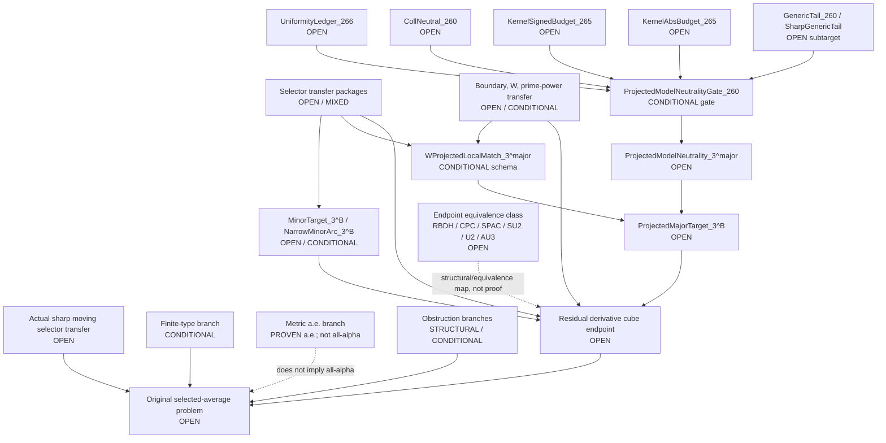

# Dependency Graph

This graph is a status map, not a proof. Solid arrows mean "would require" or
"feeds into if established." Dashed arrows mark structural/equivalence
relationships that must not be read as analytic closure.

## Reading Discipline

- The graph does not license using an endpoint object as an input to prove
  that same endpoint.
- The signed Phase H fork may target exact-model neutrality, but it does not
  prove the absolute row `CollNeutral_260`.
- The actual selected-average problem still needs the actual sharp moving
  selector and full gap discipline; model/frozen/smoothed rows are not enough.
